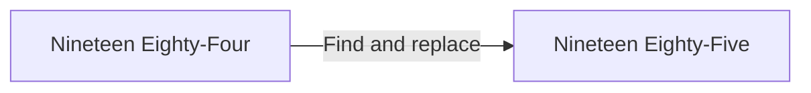

# How to translate 1984 to 1985

This manuscript folder shows you how to reproducibly build the fulltext *Nineteen Eighty-Five* book.

Basically the process is to take the old *Nineteen Eighty-Four* and apply [a very lot of find and replaces](Translations.md).



The new book also includes [some text that is fully original](Original text.md).

This is a simple Perl script and instructions are included below for setting this up on your computer.

## Obtain the fulltext *Nineteen Eighty-Four* book

To begin you will need the fulltext manuscript for George Orwell's *Nineteen Eighty-Four*.

I may not be allowed to provide a direct download link to the book to readers in the USA and Spain. 

According to the Orwell estate, copyright in this book is expired everywhere except those places. For people outside USA and Spain, please see find the book from Gutenberg Canada.

Save the complete file with the name "1984.html" into the Manuscript/Build folder.

If you prefer the command line, you would substitute the URL in like this:

```sh
curl https://EXAMPLE.COM/ebooks/ebooks/orwellg-nineteeneightyfour/orwellg-nineteeneightyfour-00-h.html > Manuscript/Build/1984.html
```

You can verify the version you have with:

```sh
shasum -a 256 Manuscript/Build/1984.html
```

A known-good version that works with this program is:

```
d1feafb325860a3a76b6fc649f797e09c5bcb8c7db0680f7ca550548b4e141ba
```

## Apply the translations

On Mac, you can install Perl using Homebrew.

Confirm you have a suitable Perl installed by running:

```sh
perl --version
```

and you should see 5.40.0 or newer.

## Run the program

Download this project to your computer using the Code > `git clone` or ZIP download instructions on the [GitHub page](https://github.com/fulldecent/Nineteen-Eighty-Five).

Then using Terminal, enter that directory and run:

```sh
perl Manuscript/Translate.pl
```

You will see two files created:

* [Build/1985.html](Build/1985.html)—the translated book
* [Build/Report.html](Build/Report.html)—a report of the translations performed (helpful while trying new translations)