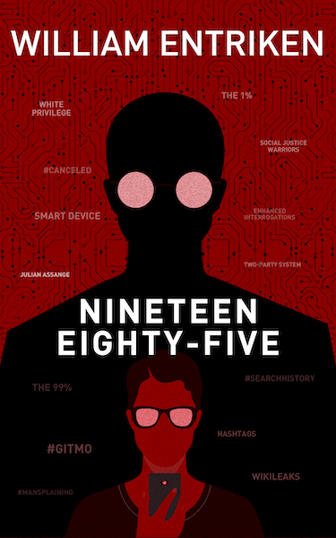

# Nineteen Eighty-Five

A novel by William Entriken, based on the public domain work of George Orwell with a similar name. This book shows that George Orwell was right all along—he accurately predicted our future, only his word usage needs to be corrected for us to see it.

This repository shares details about my journey in publishing the book on Amazon:

- Kindle eBook: [UK](https://kdp.amazon.com/amazon-dp-action/uk/dualbookshelf.marketplacelink/B08X4YMCGT) [DE](https://kdp.amazon.com/amazon-dp-action/de/dualbookshelf.marketplacelink/B08X4YMCGT) [FR](https://kdp.amazon.com/amazon-dp-action/fr/dualbookshelf.marketplacelink/B08X4YMCGT) [IT](https://kdp.amazon.com/amazon-dp-action/it/dualbookshelf.marketplacelink/B08X4YMCGT) [NL](https://kdp.amazon.com/amazon-dp-action/nl/dualbookshelf.marketplacelink/B08X4YMCGT) [JP](https://kdp.amazon.com/amazon-dp-action/jp/dualbookshelf.marketplacelink/B08X4YMCGT) [BR](https://kdp.amazon.com/amazon-dp-action/br/dualbookshelf.marketplacelink/B08X4YMCGT) [CA](https://kdp.amazon.com/amazon-dp-action/ca/dualbookshelf.marketplacelink/B08X4YMCGT) [MX](https://kdp.amazon.com/amazon-dp-action/mx/dualbookshelf.marketplacelink/B08X4YMCGT) [AU](https://kdp.amazon.com/amazon-dp-action/au/dualbookshelf.marketplacelink/B08X4YMCGT) [IN](https://kdp.amazon.com/amazon-dp-action/in/dualbookshelf.marketplacelink/B08X4YMCGT)
- Paperback: [UK](https://kdp.amazon.com/amazon-dp-action/uk/dualbookshelf.marketplacelink/B091DWSM5J) [DE](https://kdp.amazon.com/amazon-dp-action/de/dualbookshelf.marketplacelink/B091DWSM5J) [FR](https://kdp.amazon.com/amazon-dp-action/fr/dualbookshelf.marketplacelink/B091DWSM5J) [IT](https://kdp.amazon.com/amazon-dp-action/it/dualbookshelf.marketplacelink/B091DWSM5J) [JP](https://kdp.amazon.com/amazon-dp-action/jp/dualbookshelf.marketplacelink/B091DWSM5J) [CA](https://kdp.amazon.com/amazon-dp-action/ca/dualbookshelf.marketplacelink/B091DWSM5J) [AU](https://kdp.amazon.com/amazon-dp-action/au/dualbookshelf.marketplacelink/B091DWSM5J)

as well as the computer program I made to write the book. The whole book is written by a Perl script with the public domain work as input.

## Synopsis

*Nineteen Eighteen-Five* translated by William Entriken is a modern printing of the classic George Orwell book. Orwell's protagonist battles with his own incriminating **#searchhistory**, the prying eye of the **Social Justice Warriors** watching him through his **smart device**, and is ultimately denounced by the **Two-Party System** after his **Enhanced Interrogations** in **#GITMO**. Throughout his search for the meaning of **White Privilege**, he wonders if **Julian Assange** and **Wikileaks** are real or just another instrument of control by **The 1%**. Meanwhile **The 99%** watches as their language is decimated by **hashtags** and **#mansplaining**, hoping they can avoid being **#canceled**.

## This repository

- [Translation files and program](Manuscript/Translations.md)
- [Project notes](PROJECT.md) — detailed search for a literary agent/publisher, and how to self publish
- [Copyright research](./Copyright research) — proof that this project is legal

Please note that I am unable to include the actual original Nineteen Eighty-Four text, or the resultant Nineteen Eight-Five output. Because this repository is published from the United States and this title is still under copyright probably forever in USA and Spain. In the rest of the world the copyright ended 2021. If you are in the rest of the world, you are able to use your copy of the book with this program to generate Nineteen Eight-Five. See LICENSE below.

## License

Copyright William Entriken 2021.

This is a work of fiction. Names, characters, businesses, places, events, locales, and incidents are either the products of the author’s imagination or used in a fictitious manner. Any resemblance to actual persons, living or dead, or actual events is purely coincidental.

No part of this book may be reproduced, or stored in a retrieval system, or transmitted in any form or by any means, electronic, mechanical, photocopying, recording, or otherwise, without express written permission of the author.

Original text: Nineteen Eighty-Four by George Orwell  (copyright ended with the exception of the US and Spain)

Cover artwork: 100Covers

I am sharing this repository because sharing is the default. And I would love to hear your feedback on the specific word choices I made for these substitutions. But I do not grant you the right to create copies of my book or to sell my work.